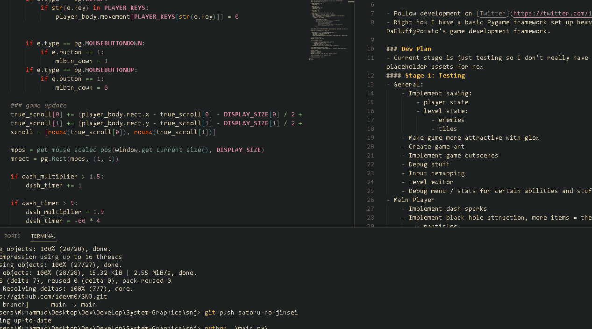

# SNJ - Satoru No Jinsei

### About
A game inspired by the Jujutsu Kaisen anime, based off of Gojo Satoru's character.
I've been working on this game for a few weeks on and off to create a more consolidated project in terms of the various games I've made and improve my portfolio. 

- Follow development on [Twitter](https://twitter.com/1dev_m0) 
- Right now I have a basic Pygame framework set up heavily inspired by DaFluffyPotato's game development framework.

### Dev Plan
- Current stage is just testing so I don't really have much, and the art is just placeholder assets for now
#### Stage 1: Testing
- General:
    - Implement saving:
        - player state
        - level state:
            - enemies
            - tiles
    - Make game more attractive with glow
    - Create game art
    - Implement game cutscenes
    - Debug stuff
    - Input remapping
    - Level editor
    - Debug menu / stats for certain abilities and stuff
- Main Player
    - Implement dash sparks
    - Implement black hole attraction, more items = the bigger it gets
        - particles
    - Implement white hole repulsion, more items = smaller it gets
        - particles
    - Implement purple, pure destruction
    - Level Destruction
    - Black flash & Combos
    - Sound Effects
    - Implement ability timeouts and visuals
    - Implement player teleport
    - Implement player melees with sparks
    - Implement basic enemies with health